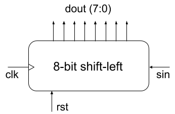

# shift-register
Consider an 8-bit shift-left register and its corresponding VHDL description, and assume that we want to expand it in order to support bidirectional shifting and parallel load inputs.



```
-- USN VHDL 101 course
-- 8-bit shift-left register

library ieee;
use ieee.std_logic_1164.all;

entity slr8bits is
    Port ( clk, rst, sin: in std_logic;
                 dout: out std_logic_vector (7 downto 0)
                );
end slr8bits;

architecture arch of slr8bits is
signal ffin, ffout: std_logic_vector (7 downto 0);
begin
-- state register section
process (clk, rst)
        begin
                if (rst = '1') then
                        ffout <= (others => '0');
                elsif rising_edge(clk) then
                        ffout <= ffin;
        end if;
end process;
-- outputs section
ffin <= ffout (6 downto 0) & sin;
dout <= ffout;
end arch;

 
```

1.Create a function table describing the operation of the expanded shift-register.

2.Expand the VHDL description presented to support the additional operating modes.

3.Prove the correctness of your solution by simulation in Vivado.
 
